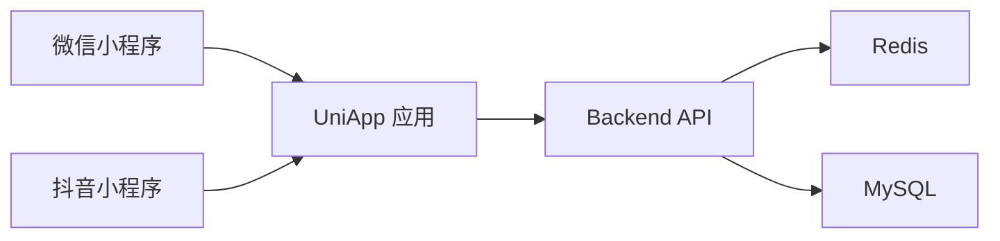
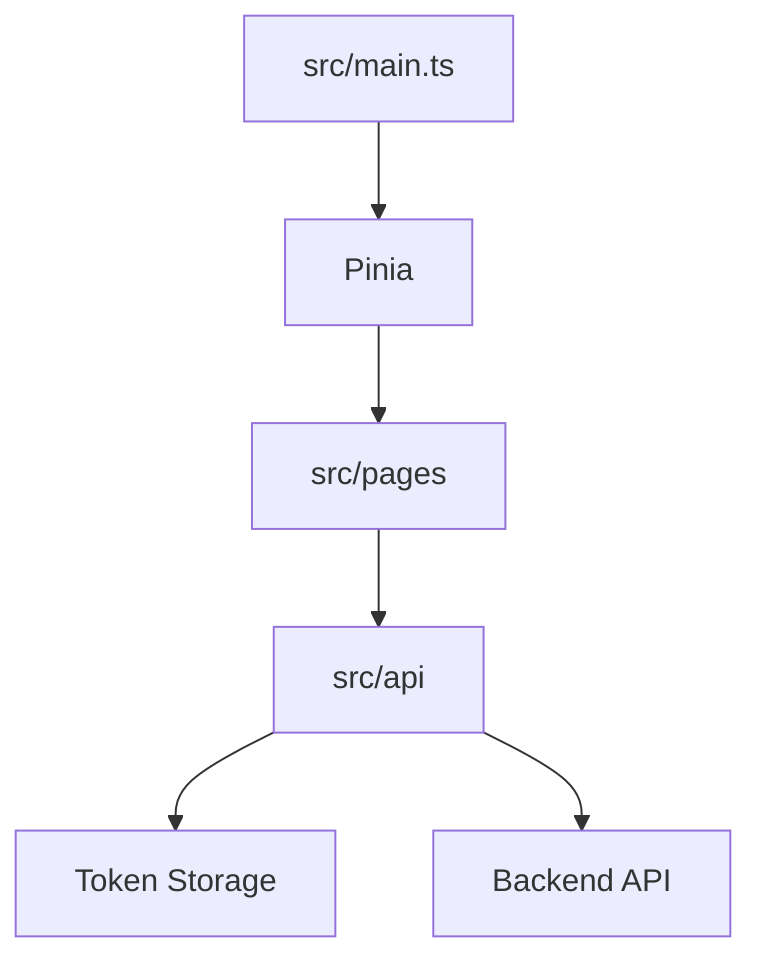

# template-uniapp-mini

一套基于 UniApp 的小程序模板，默认对接统一 JWT 登录后端，内置登录页、首页、用户中心，并支持微信小程序与抖音小程序双目标构建，适合后续继续生长业务页面。

## 1. 项目定位

- 技术定位：`UniApp 3.x + Vue 3 + TypeScript + Pinia`
- 业务定位：微信 / 抖音小程序业务壳
- 对接方式：与 `template-go-backend` 共用登录、刷新、当前用户接口

## 2. 技术栈

- UniApp `3.x`
- Vue `3.4.21`
- TypeScript `5.9.3`
- Pinia `2.1.7`
- uView Plus `3.7.13`

说明：

- 当前模板已安装 `uView Plus` 依赖
- 为保证当前版本组合可以稳定构建，页面默认先使用原生组件样式
- 如后续你要全面接入 uView 组件，可以在确认 UniApp / Sass 组合稳定后再逐步切换

## 3. 架构图

### 3.1 系统关系图



### 3.2 小程序内部结构图



## 4. 页面结构

已内置页面：

- `pages/login/index`：登录页
- `pages/index/index`：首页
- `pages/user/index`：用户中心

## 5. 目录结构

- `src/api`：统一请求封装与认证接口
- `src/pages`：页面目录
- `src/store`：Pinia 状态
- `src/common`：常量、存储、兼容层
- `src/static`：静态资源
- `manifest.config.ts`：模板清单配置
- `src/manifest.json`：UniApp CLI 兼容清单
- `pages.json` / `src/pages.json`：页面与 tabbar 配置

## 6. 本地开发使用方式

### 6.1 安装依赖

```powershell
npm install
```

### 6.2 类型检查

```powershell
npm run type-check
```

### 6.3 微信小程序开发

```powershell
npm run dev:mp-weixin
```

### 6.4 抖音小程序开发

```powershell
npm run dev:mp-toutiao
```

## 7. 登录说明

默认登录方式：

- 账号密码登录
- 登录成功后保存 `accessToken` 与 `refreshToken`
- 用户页会读取当前用户信息

当前模板故意没有直接接微信 / 抖音平台 `code -> token` 流程，目的是先保证多端统一底座可运行，后续再在认证服务层扩展平台登录。

## 8. 构建与发布方式

### 8.1 微信小程序构建

```powershell
npm run build:mp-weixin
```

产物目录：

- `dist/build/mp-weixin`

然后使用微信开发者工具导入该目录即可继续调试与上传。

### 8.2 抖音小程序构建

```powershell
npm run build:mp-toutiao
```

产物目录：

- `dist/build/mp-toutiao`

然后使用抖音开发者工具导入该目录即可继续调试与上传。

### 8.3 线上发布建议

- 小程序前端本身不需要传统服务器部署
- 需要保证后端 API、域名白名单、合法请求域名配置正确
- 上线前把 `src/common/constants.ts` 中的 API 地址替换为正式环境地址

## 9. 常用命令

```powershell
npm run type-check
npm run dev:mp-weixin
npm run build:mp-weixin
npm run dev:mp-toutiao
npm run build:mp-toutiao
```

## 10. 兼容说明

当前仓库包含以下兼容文件：

- [`src/common/vue-compat.ts`](/D:/NexAI/code/miniapp/src/common/vue-compat.ts)
- [`src/manifest.json`](/D:/NexAI/code/miniapp/src/manifest.json)
- [`src/pages.json`](/D:/NexAI/code/miniapp/src/pages.json)

它们的作用是让当前模板在本地 CLI 环境下稳定通过构建，不影响你后续按业务继续开发。

## 11. 验证结果

当前模板已实际通过：

- `npm run type-check`
- `npm run build:mp-weixin`
- `npm run build:mp-toutiao`

## 12. 扩展建议

- 在 `src/pages` 下新增业务页面，如订单、会员、活动、消息中心
- 如果接入平台登录，优先扩展后端认证接口，再替换登录页流程
- 若后续全面使用 uView，建议先统一升级并验证 UniApp / Sass / Vue 组合版本

