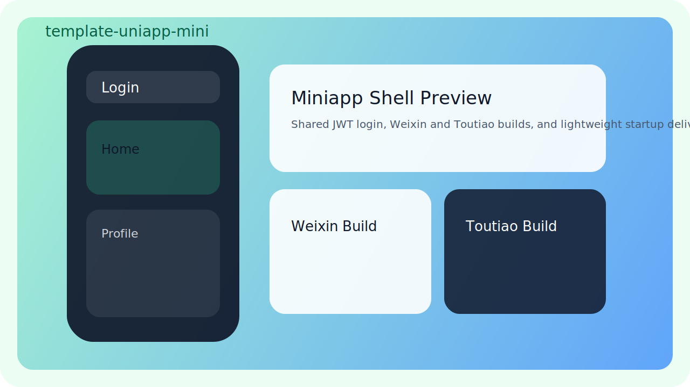
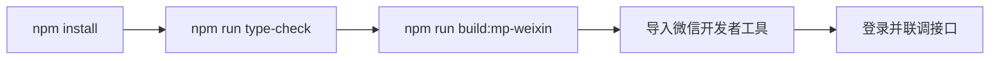
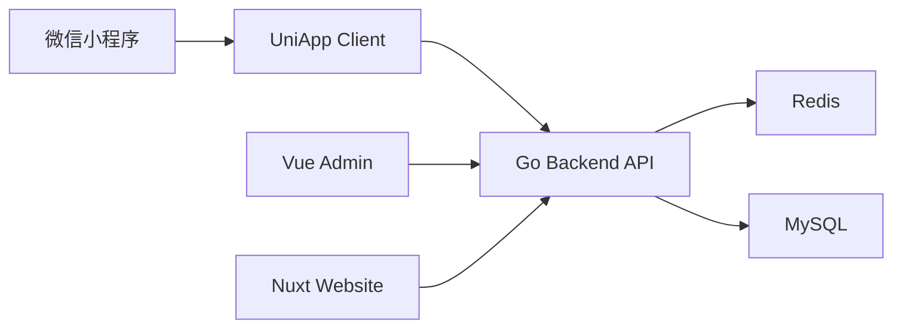
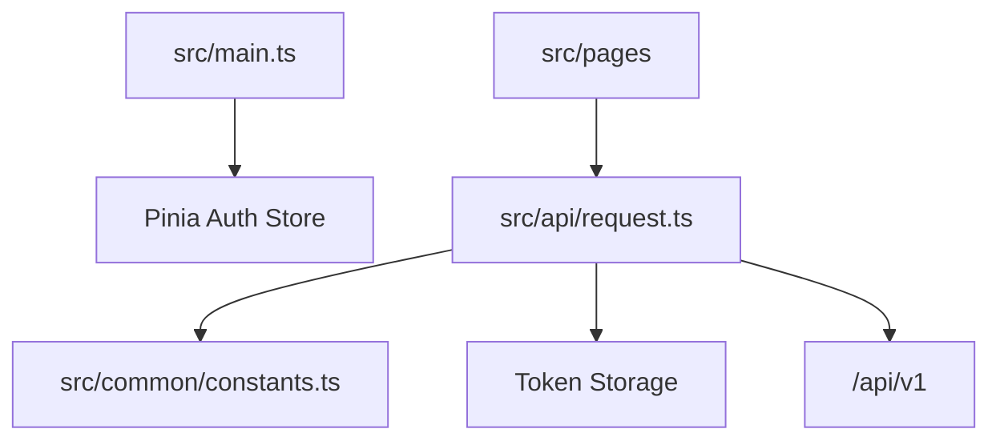
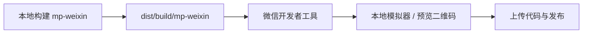

# template-uniapp-mini


一套基于 UniApp 的小程序模板，默认对接统一 JWT 后端，内置登录页、首页、用户中心，并保留多端扩展结构。当前仓库以微信小程序为主进行开发和联调，抖音小程序保留构建骨架，后续可按实际资质再启用。

## 预览占位图



## 治理文档

- [LICENSE](./LICENSE)
- [CONTRIBUTING.md](./CONTRIBUTING.md)
- [COMMIT_CONVENTION.md](./COMMIT_CONVENTION.md)
- [CODE_OF_CONDUCT.md](./CODE_OF_CONDUCT.md)
- [SECURITY.md](./SECURITY.md)
- [SUPPORT.md](./SUPPORT.md)
- [MAINTAINERS.md](./MAINTAINERS.md)
- [RELEASE.md](./RELEASE.md)
- [CHANGELOG.md](./CHANGELOG.md)
- [COLLABORATION.md](./COLLABORATION.md)

## 项目定位

- 技术栈：`UniApp 3.x + Vue 3 + TypeScript + Pinia`
- 当前主目标：微信小程序本地开发、联调、提测
- 接口协议：与 `template-go-backend`、`template-vue-admin` 共用统一 JWT 和响应信封
- 页面范围：首页、登录页、用户中心

## 技术版本

- UniApp `3.x`
- Vue `3.4.21`
- TypeScript `5.9.3`
- Pinia `2.1.7`
- uView Plus `3.7.13`

## 快速开始



## 架构图

### 系统关系



### 应用内部



## 目录结构

- `src/api`：统一请求层、认证接口、刷新 Token
- `src/pages/index`：首页
- `src/pages/login`：登录页
- `src/pages/user`：用户中心
- `src/store`：Pinia 状态管理
- `src/common`：常量、存储、Vue 兼容层
- `src/static`：静态资源
- `manifest.config.ts`：主清单配置
- `src/manifest.json`：UniApp CLI 兼容清单
- `vite.config.ts`：UniApp Vite 配置

## 本地开发

### 安装依赖

```powershell
npm install
```

### 类型检查

```powershell
npm run type-check
```

### 微信小程序构建

```powershell
npm run build:mp-weixin
```

构建产物目录：

- `dist/build/mp-weixin`

然后在微信开发者工具中导入该目录即可。

## 接口地址配置

仓库已经支持通过环境变量配置 API 地址。

默认行为：

- 未设置环境变量时，使用 `http://localhost:8080/api/v1`
- 适合本机微信开发者工具模拟器联调

如果要切到真机预览，请复制 `.env.example` 为 `.env.local`，再改成你电脑的局域网地址，例如：

```dotenv
VITE_API_BASE_URL=http://192.168.1.23:8080/api/v1
```

注意事项：

- 手机无法访问你电脑的 `localhost`
- 后端需要监听本机可访问地址，并放通防火墙
- 微信后台还需要配置合法 request 域名后，才能走正式线上接口

## 登录联调说明

当前模板默认使用账号密码登录，对接统一后端接口：

- `POST /api/v1/auth/login`
- `POST /api/v1/auth/refresh`
- `GET /api/v1/auth/profile`

登录成功后会持久化：

- `accessToken`
- `refreshToken`
- `profile`

当前模板暂不直接接入微信 `code -> token` 登录流程，目的是先保证模板骨架和统一鉴权链路稳定可用。后续如需接入微信授权，优先扩展后端认证服务，再替换登录页流程。

## 页面说明

- `pages/login/index`：账号密码登录，页面会显示当前 API 地址
- `pages/index/index`：展示当前登录态和接口来源
- `pages/user/index`：展示用户信息、角色、权限，并支持退出登录

## 部署 / 发布方式



发布步骤建议：

1. 本地执行 `npm run type-check`
2. 执行 `npm run build:mp-weixin`
3. 导入 `dist/build/mp-weixin`
4. 在微信开发者工具中完成预览、上传、版本备注
5. 在微信公众平台完成提审与发布

## 兼容说明

当前仓库包含以下兼容文件，用于保证 UniApp CLI 构建稳定：

- `src/common/vue-compat.ts`
- `src/vue-compat.d.ts`
- `src/manifest.json`

这些文件不会改变业务结构，主要用于兼容当前依赖组合下的构建行为。

## 验证结果

当前模板已经实际验证通过：

- `npm run type-check`
- `npm run build:mp-weixin`
- 微信开发者工具导入项目
- 微信开发者工具生成预览包
- 登录页、首页、用户中心基础点击联调

## 后续扩展建议

- 新增订单、会员、消息、活动等业务页面
- 接入微信 `code -> token` 登录
- 补充接口错误态、空状态和加载态
- 补充埋点、版本更新提示和灰度发布策略
